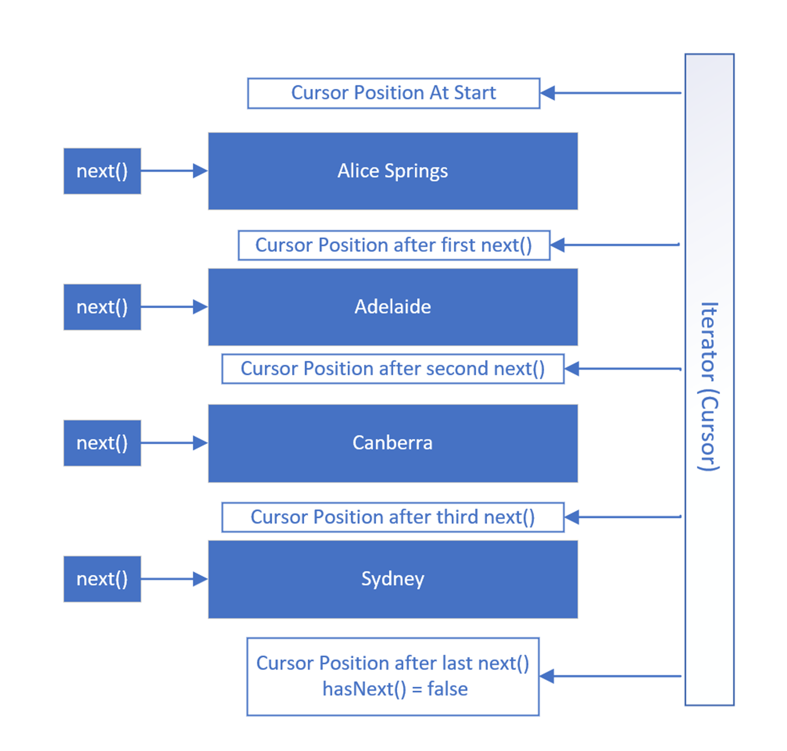

#### ArrayList:
- An ArrayList is implemented on top of an array.
- Implements all of List's methods.
#### LinkedList:
- LinkedList is a doubly linked list.
- Implements all of List's methods and also stack and queue methods.
#### Queue:
- `First-In, First-Out(FIFO)`
- Poll the queue - get first element from the list.
- offer into the queue - add element at the end of list.
- Single-ended queues always process elements from the start of the queue.
- A double-ended queue allows access to both the start and end of the queue.
- A LinkedList can be used as a double ended queue.
#### Stack:
- `Last-In, First-Out(LIFO)`
- push to the stack - adds elements to the top of list.
- pop from the stack - removes element from the top of the list.
- A LinkedList can be used as a stack as well.
#### Iterator:
- An Iterator is forwards only.
- only supports the remove method.
- `hasNext()` and `next()` methods are widely used.
#### ListIterator:
- A ListIterator allows you to navigate both forwards and backwards.
- Besides the remove method, it also supports the add and set methods.
- Similar to `hasNext()` and `next()`, we have `hasPrevious()` and `previous()` methods.

Iterators cursor position are between the elements.

#### Boxing and Unboxing:
| Boxing                                                         | Unboxing                                                       |
|----------------------------------------------------------------|----------------------------------------------------------------|
| Converting a primitive to its Wrapper class type.              | Converting a Wrapper class type to primitive.                  |
| Manual-boxing -> `Integer boxedInteger = Integer.valueOf(15);` | Manual-Unboxing -> `int unboxedInt = boxedInteger.intValue();` |
| Auto-boxing -> `Integer autoBoxedInteger = 15;`                | Auto-Unboxing -> `int autoUnboxedInt = autoBoxedInteger;`      |

#### Enums:
- A special data type that contains predefined constants
- An enum is a little like an array, except its elements are known, not changeable, and each element can be referred to by a constant name, instead of an index position.
- Underneath the covers, the enum type is a special type of class, which contains fields to support the constants.
- We can have methods inside enums.