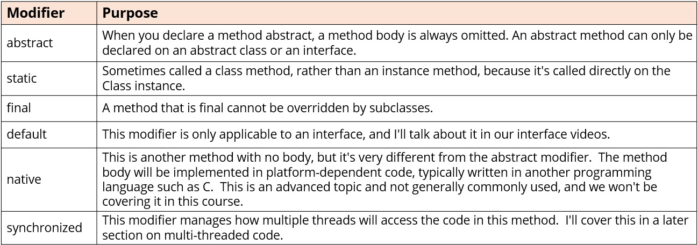

_#### Abstraction:
- The most general class, basic building block, which everything can be said to have in common.
- You can generalize a set of characteristics and behavior into an abstract type.
#### Abstract class:
- An abstract class's purpose is to define the behavior its subclasses are required to have, so it always participates in `inheritance`.
- The abstract class is declared with the abstract modifier. Ex:`abstract class Animal{}`
- An abstract class is a class that's incomplete.
- You can't create an instance of an abstract class.
- An abstract class can still have a constructor, which will be called by its subclasses during their construction.
- The extending child class, must implement all the abstract methods of the Abstract Class.
- A class `extends` only one class, that is why java supports only `single inheritance`.
#### Abstract method:
- An abstract method has a method signature, and a return type, but doesn't have a method body.
- An abstract method is declared with the modifier `abstract`. Ex:`public abstract void move();`
- We say an abstract method is `unimplemented`.
- Abstract methods cannot be private, as they must be implemented by its subclasses.
- Abstract methods can only be declared on an abstract class or interface.
#### Concrete method:
- A concrete method has a method body, usually with at least one statement.
- This means it has operational code, that gets executed, under the right conditions.
- A concrete method is said to implement an abstract method, if it overrides one.
#### Method modifiers:

#### Interface:
- An interface is similar to an abstract class, although it isn't a class at all.
- A class that `implements` `interface`, must implement all the abstract methods on that interface.
- A class can implement one or many interfaces.
- `public interface FlightEnabled{ }`
- An interface can `extends` one or more interfaces.
- All the methods in Interface are `public`, unless specified.
#### Abstract methods in Interface:
- In interface, any method declared without a body, is really implicitly declared both `public` and `abstract`. Ex: `void move();`
- If you omit an access modifier on a `class member`, it's implicitly `package private`.
- If you omit an access modifier on an `interface member`, it's implicitly `public`.
- Only a concrete method can have `private` access.
- No method in interface can have `protected` access.
- `fields` in interface are always `public static final`. Ex: `double MILE_TO_KM = 1.60934;`

#### Final modifier in Java:
When we use the final modifier, we prevent any further modifications to that component.
- a final method means it can't be overridden by a subclass.
- a final field means an object's field can't be reassigned or given a different value after its initialization.
- a final static field is a class field that can't be reassigned or given a different value after the class's initialization process.
- a final class can't be overridden, meaning no class can use it in the extends clause.
- a final variable in a block of code, means that once it's assigned a value any remaining code in the block can't change it.
- a final method parameter means we can't assign a different value to that parameter in the method code block.

#### Constants in Java:
- A constant in Java is a variable that can't be changed.
- A constant variable is a final variable of primitive type, or type String, that is initialized with a constant expression.
- Constants in Java are usually named with all uppercase letters and with underscores between words.
- A static constant means we access it via the type name.
- Ex: We saw this with the INTEGER.MAX_VALUE, and the INTEGER.MIN_VALUE fields.

#### Abstracted Types - Coding to an Interface:
- Both interfaces and abstract classes are `abstracted reference types`.
- Reference types can be used in code, as variable types, method parameters, return types, list types, and so on.
- When you use an abstracted reference type, this is referred to as `coding to an interface`.
- This means your code doesn't use specific types, but rather, more generalized ones, usually an interface type.
- This technique is preferred, because it allows many runtime instances of various classes to be processed uniformly by the same code.
- It also allows for substitutions of some other class or object that still implements the same interface, without forcing a major refactor of your code.
- Using interface types as the reference type is considered a best practice.
