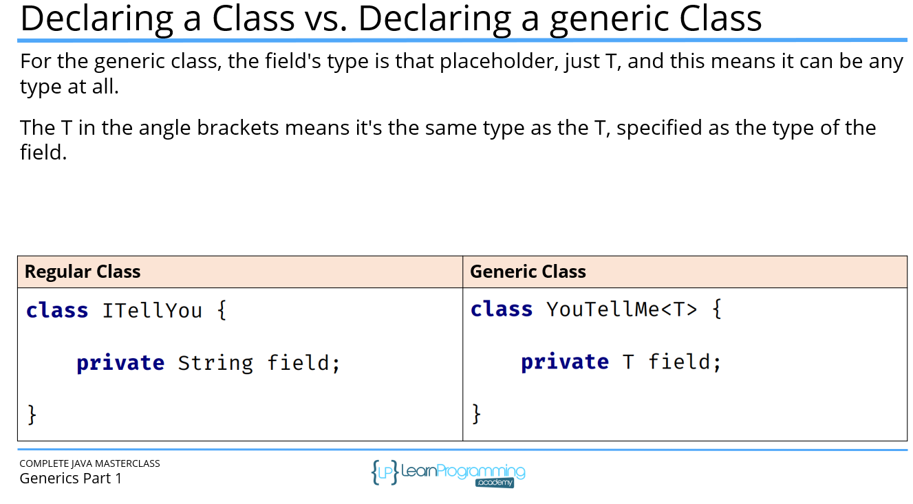
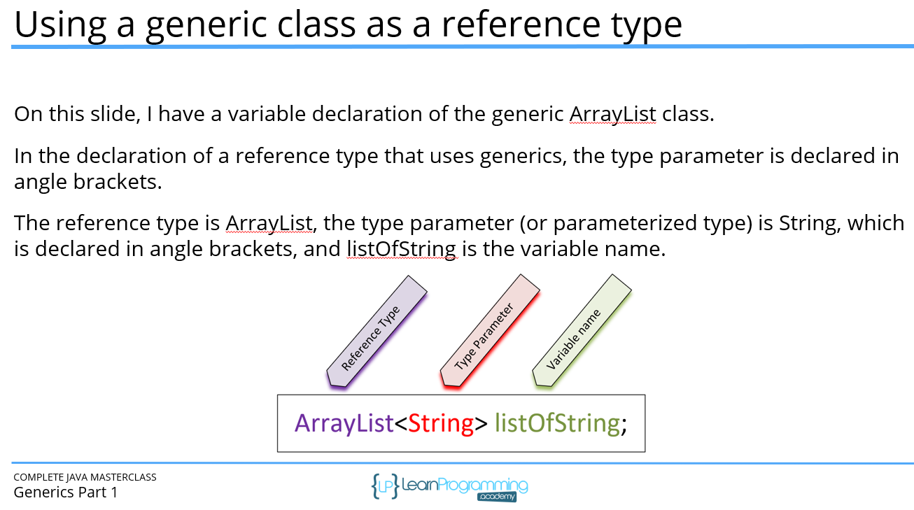
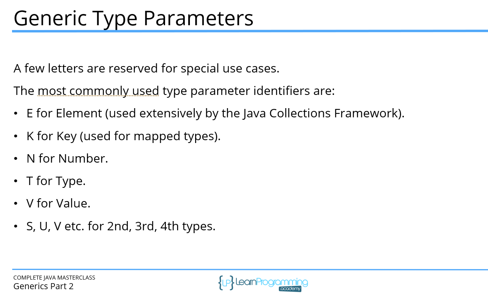
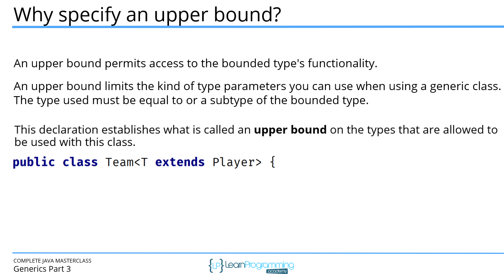
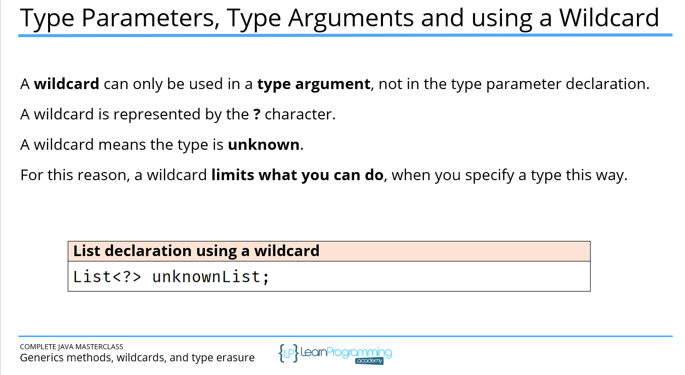
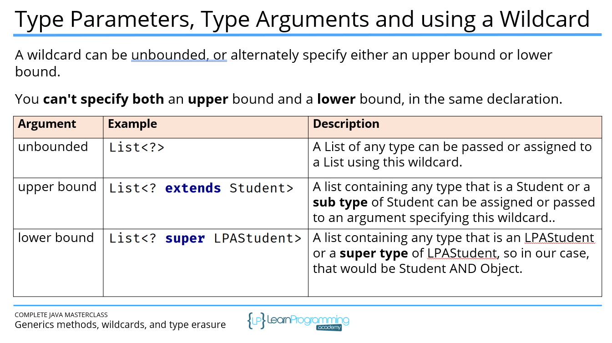
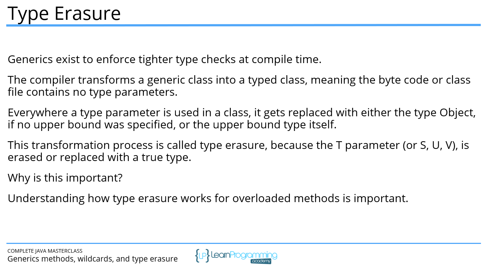

### Generics:

### Comparable vs Comparator:
| Feature | Comparable | Comparator |
|--------|------------|------------|
| Interface method | `compareTo()` | `compare()` |
| Sorting type | Natural ordering | Custom / multiple orderings |
| Affects class? | Yes — requires modifying the class | No — kept outside the class |
| Number of orderings | Only one | Many (flexible) |
| Used in | `Collections.sort(list)` or `Arrays.sort()` | `Collections.sort(list, comparator)` or `stream().sorted(comparator)` |
| Typical use case | When object has a default/natural sort order | When different sorting strategies are needed |
| Package | `java.lang` | `java.util` |
| Easy example | Sort by ID | Sort by name, salary, age, etc. |

### Wildcards:

### TypeErasure:
- Type Erasure removes generic type information at runtime, making List<String> and List<Integer> the same List class.
- Generics exists only at compile time, not runtime.
