### Lambda expressions:
- a shorthand for an anonymous class that implements a functional interface—an interface that contains only a single abstract method. This makes your code more concise and easier to understand.
- Lambda expressions allow you to pass blocks of code as parameters.
- Syntax: `(parameter1, parameter2, ...) -> expression;`
- Example: `(o1, o2) -> o1.lastname().compareTo(o2.lastname())`
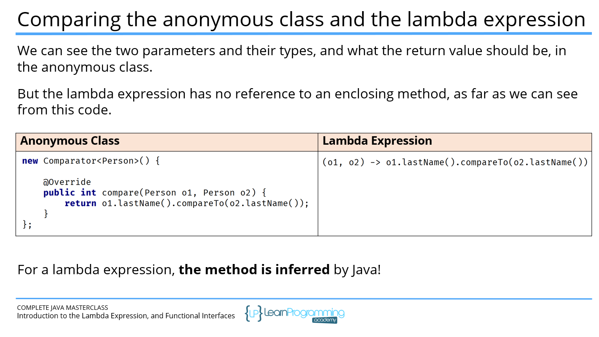

### Lambda expression variations:
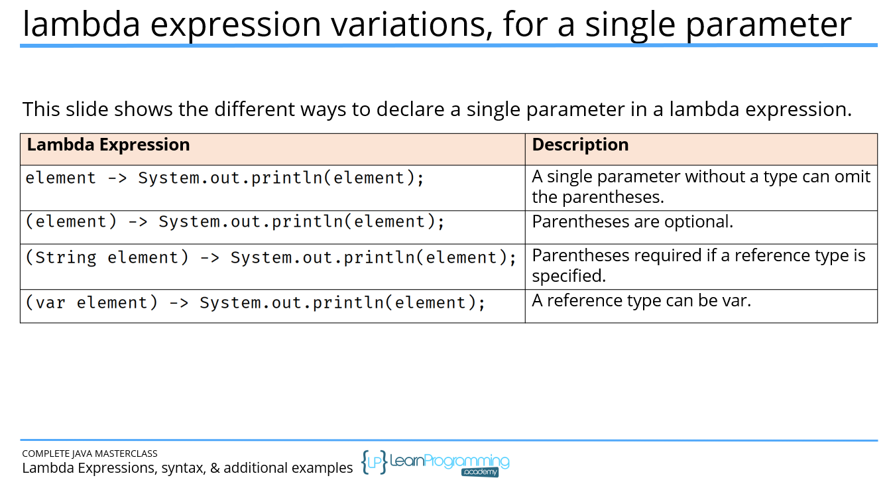
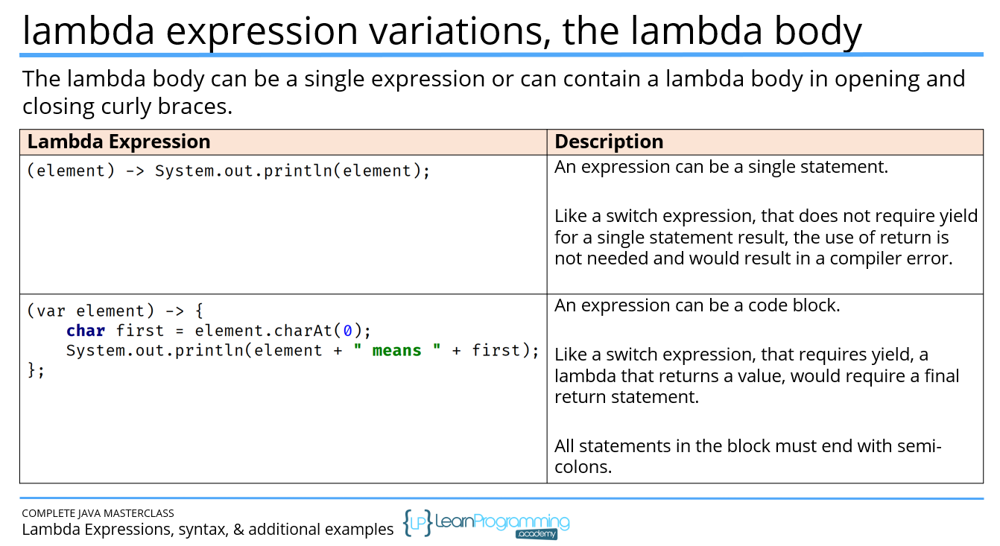
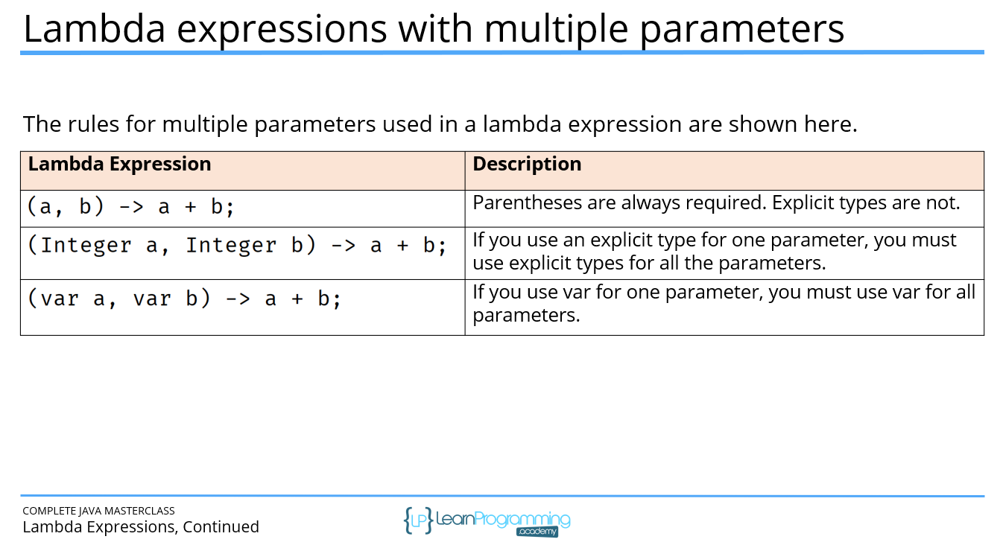
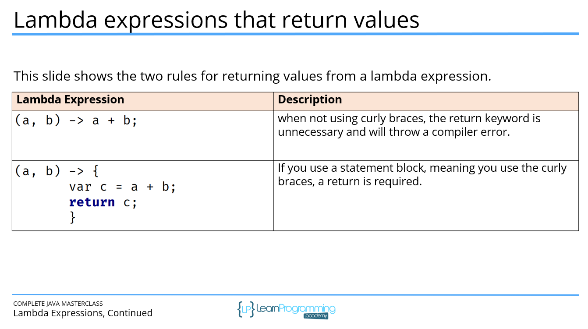

### Functional interface:
- A functional interface is an interface that has one, and only one, abstract method.
- This is how Java can infer the method to derive the parameters and return type, for the lambda expression.
- You may also see this referred to as SAM, which is short for Single Abstract Method, which is called the functional method.
- A functional interface is the target type for a lambda expression.

### The Four categories of Functional Interfaces:
- Java provides a library of functional interfaces in the java.util.function package.
- There are over forty interfaces in this package.
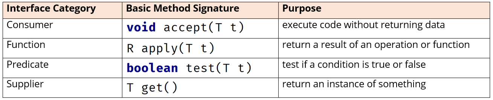

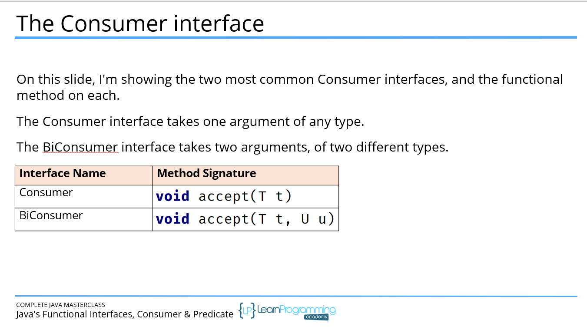
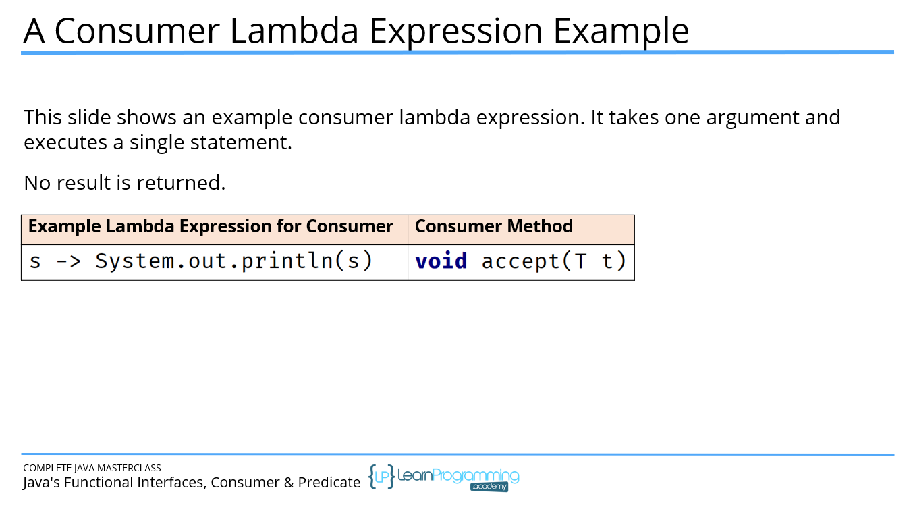
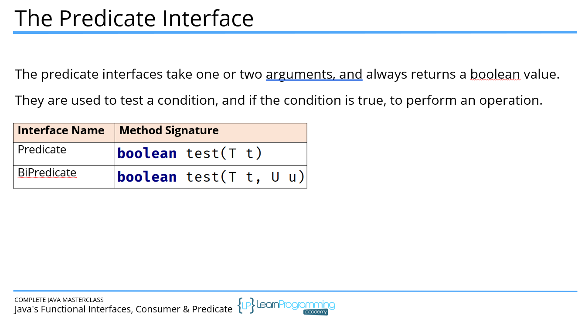
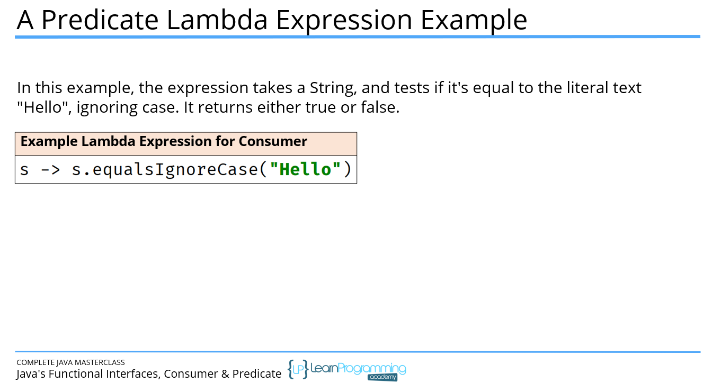
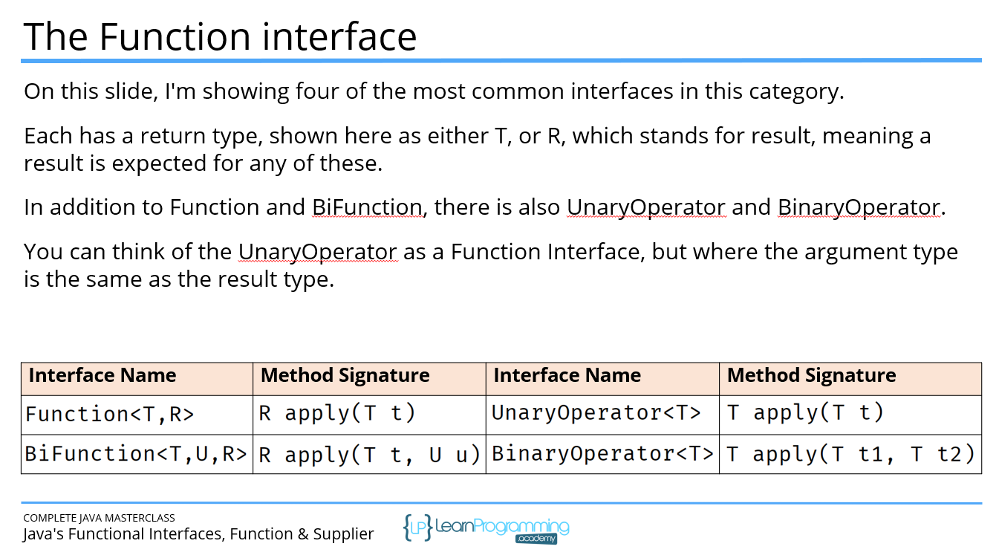
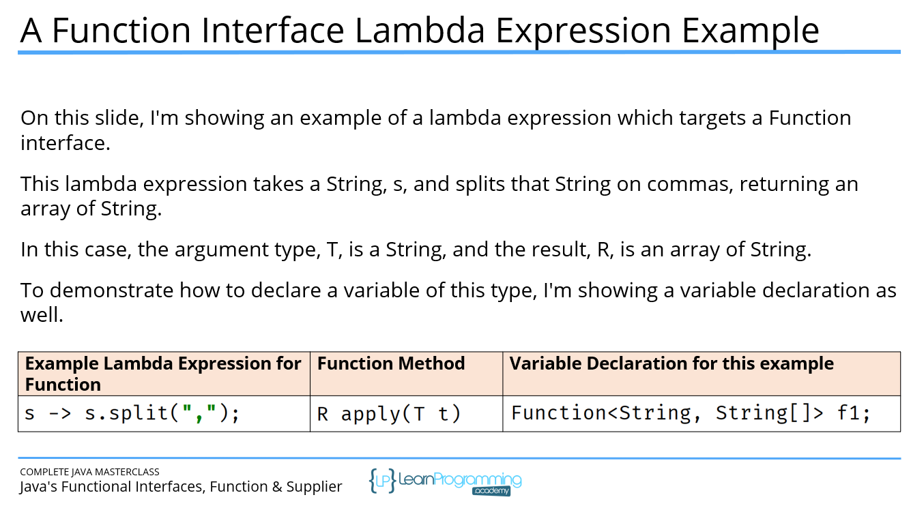
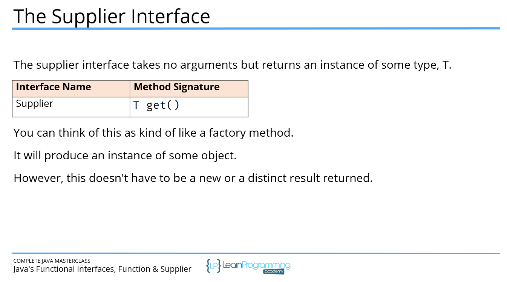
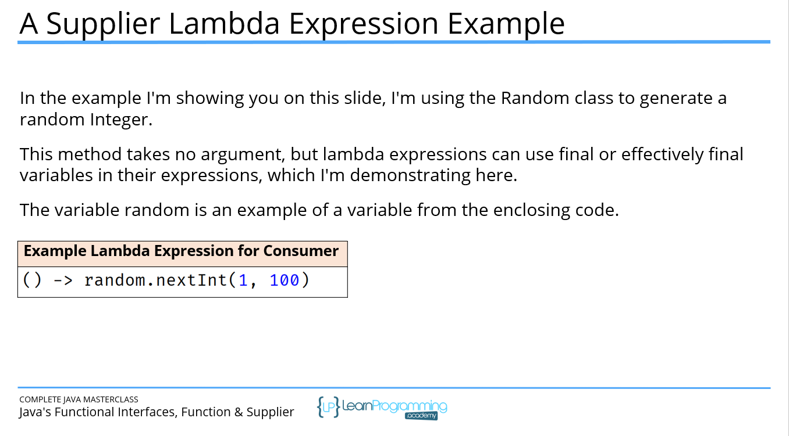
