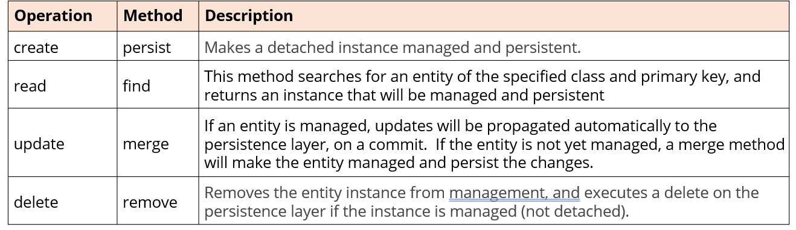
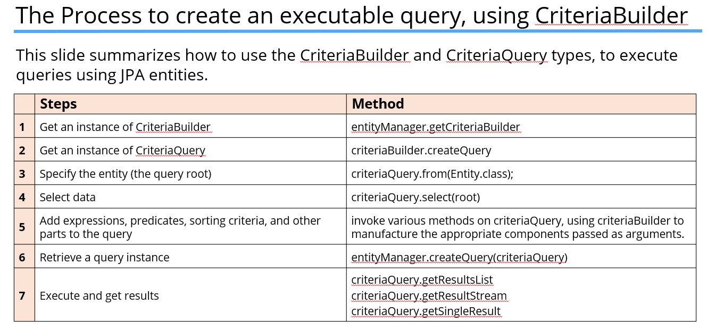
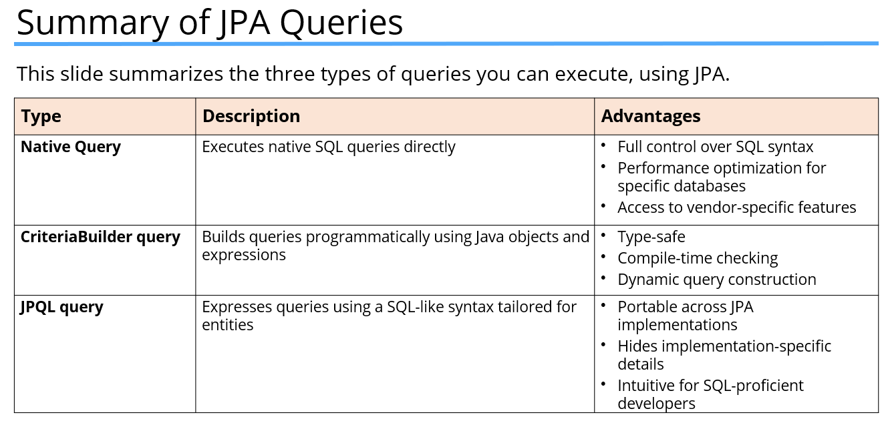

### JPA(Jakarta Persistence API):
- JPA is a specification. There's no default implementation of the specification, provided in Java's Standard Edition.
- Some popular implementations are Hibernate, Spring JPA, and EclipseLink, to name a few. These are called JPA Providers.

### Key concepts of JPA:
- Object-Relational Mapping, or ORM.
- The Entity (which is the mapped object), and the Entity Manager which manages lifecycles of these entities.
- The Persistence Context is a special cached area where the entities exist.

### Object-Relational Mapping(ORM):
- Object-Relational Mapping is a method of mapping database tables defined by columns, to a class with correlated fields, and setters and getters. 
- A record in a table then becomes an instance of one of these classes.

### Entity:
- Entity is a class that represents a table in a relational database.
- Each entity is annotated with metadata.

### Entity Manager:
- The entity manager is implemented by the JPA Provider.
- An entity can exist in a managed state, managed by the Entity Manager.
- Or it can exist in a detached state, outside an Entity Manager. 
- A detached entity can then be merged into an EntityManager, if a commit is needed to a persistence layer.

### Persistence Context:
- It tracks the lifecycle state of managed entities. 
- It synchronizes changes made to managed entities with the database. 
- It performs identity management, ensuring unique entity identity within a transaction. 
- It acts as a cache, reducing database roundtrips by keeping frequently accessed entities in memory, for faster retrieval.

### Three options to execute a query in JPA:
- JPA Query, using a special query language, named JPQL.
- Criteria Builder, which is a more programmatic way to put together the selection request.
- Native Query, relies on SQL.

### JPA Query(JPQL):
- The Java Persistence Query Language, or JPQL, is an object-oriented query language.
- It provides a way to query data stored in relational databases, without needing to understand the details, of how the data is actually structured there.

### CriteriaBuilder:

